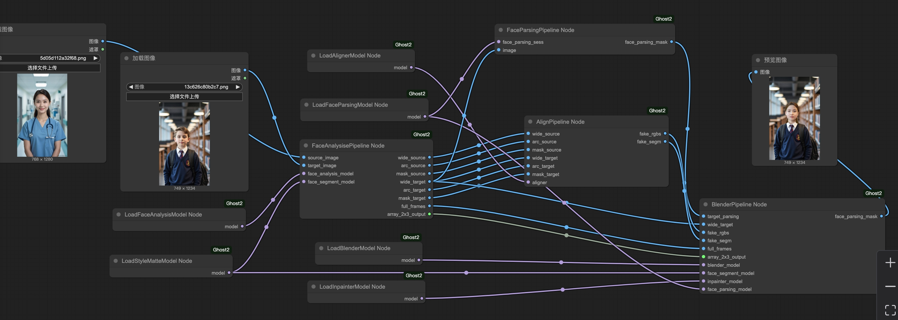
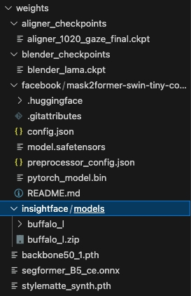

# ComfyUI-GHOST-2.0
ComfyUI adaptation of [GHOST 2.0](https://github.com/ai-forever/ghost-2.0).



## Installation

### Manually:
#### Clone Code
- Clone ComfyUI;  
And clone this repo into `custom_nodes` folder in ComfyUI and install the dependencies.
```bash
git clone https://github.com/comfyanonymous/ComfyUI
cd ComfyUI/custom_nodes
git clone https://github.com/Holasyb918/Ghost2_Comfyui
cd Ghost2_Comfyui
python install.py
```  

#### Prepare Weights
```bash
bash download.sh
```
Weights folder should be like:  



## Star this project!
If you find this project useful, please consider giving it a star on GitHub. This helps the project to gain visibility and encourages more contributors to join in. Thank you for your support!

## Contribute
Thanks for your interest in contributing to the source code! We welcome help from anyone and appreciate every contribution, no matter how small!
